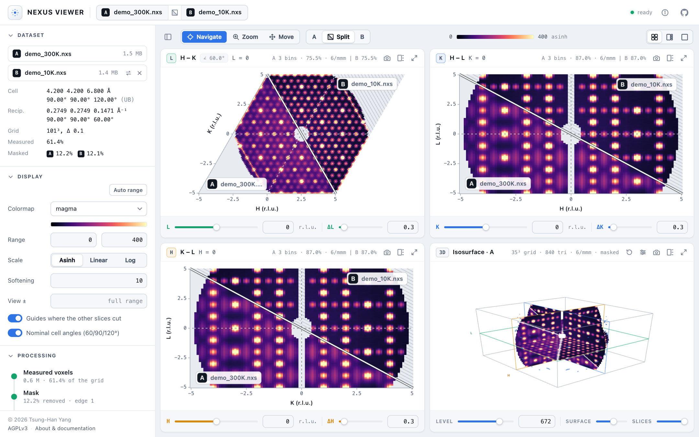

# NeXus Viewer

[](https://drthyang.github.io/neutron-nexus-viewer/)
[](https://github.com/drthyang/neutron-nexus-viewer/actions/workflows/test.yml)
[](LICENSE)
[](https://drthyang.github.io/neutron-nexus-viewer/)

**Reciprocal-space slices and line cuts of 3-D neutron scattering data, with symmetry
averaging, artifact masking, two-dataset comparison, a 3-D view and I(Q), all in your browser.**

**▶ Try it: [drthyang.github.io/neutron-nexus-viewer](https://drthyang.github.io/neutron-nexus-viewer/)** —
nothing to install, and your data never leaves your machine. Open a Mantid `.nxs`
file, or [the example](https://drthyang.github.io/neutron-nexus-viewer/?demo): one synthetic crystal at 300 K and 10 K, where
short-range-order diffuse scattering condenses into superlattice peaks.

<p align="center">
  
</p>

## Goals

- **The data as measured, in its true geometry.** Slices are drawn with the
  reciprocal metric from the file's UB matrix, so oblique axes meet at their real
  angle and equal lengths in r.l.u. look equal. Nothing is smoothed or interpolated.
- **Processing you can check.** Symmetry averaging maps bins onto bins exactly and
  warns when the operations do not fit the cell. Masks can be previewed voxel by
  voxel and exported. The slice engine is tested against the reference Python
  implementation. See [docs/METHOD.md](docs/METHOD.md).
- **Fast, private, nothing to install.** A static page reads the file locally with
  [h5wasm](https://github.com/usnistgov/h5wasm): a 401³ volume opens in about 2 s,
  and slices update in tens of milliseconds.

## Features

| Area | What you get | Read more |
| --- | --- | --- |
| **Slices** | HK, HL and KL cuts with live slab center and thickness. Click to move the other slices through a point, drag a box to zoom, or drag to pan (pinch on a touch screen); quad, focus and single layouts | [Slice views](docs/USER_GUIDE.md#slice-views) |
| **Line cuts** | Drag a line across a slice for a 1-D profile of the volume along any direction in its plane, averaged over a band of adjustable width and the slice's thickness, with symmetry pooling, σ and both datasets; saved as text | [Line cuts](docs/USER_GUIDE.md#line-cuts) · [Method](docs/METHOD.md#line-cuts) |
| **Symmetry averaging** | Any Laue class or your own operations, closed into a group and applied exactly on the bin grid, with a check that they fit the cell | [Symmetry](docs/METHOD.md#symmetry-averaging) |
| **Artifact masking** | Removes detector-edge voxels and symmetry outliers before averaging; preview what is removed and export the mask as a NumPy array | [Masking](docs/METHOD.md#masking-detector-edge-artifacts) |
| **Two-dataset comparison** | A second file, such as another temperature, splits every slice along its diagonal, with shared positions, processing and color scale; hover reads both values | [Comparing](docs/USER_GUIDE.md#comparing-two-datasets) |
| **3-D view** | A transparent isosurface of the processed volume, with the current slices as planes | [3-D view](docs/USER_GUIDE.md#3-d-view) |
| **I(Q)** | The processed volume reduced to 1-D, on request: the mean intensity per \|Q\| shell over the voxels with data, with symmetry orbits weighted by multiplicity, split voxels, propagated σ and shell coverage; saved as text | [I(Q)](docs/USER_GUIDE.md#iq) · [Method](docs/METHOD.md#powder-average-iq) |
| **Hand-off to NEBULA3D** | One click sends the masked, symmetrized volume to [NEBULA3D](https://github.com/drthyang/nebula3d)'s 3D-ΔPDF pipeline in a new tab, or saves it as a file | [Export](docs/USER_GUIDE.md#export-for-nebula3d) |
| **Any screen** | Laptops to 4K and 5K monitors (drawn larger at 100% scaling), tablets and phones: views first on narrow screens, touch-sized controls and pinch zoom | [The screen](docs/USER_GUIDE.md#the-screen) |
| **Files and links** | Mantid `MDHistoWorkspace` (`SaveMD`) and any 3-D `NXdata`; local files or links that open a file, a comparison, symmetry and mask; PNG export with a colorbar | [Opening data](docs/USER_GUIDE.md#opening-data) |

## Quick start

1. Open the [live app](https://drthyang.github.io/neutron-nexus-viewer/) and choose a `.nxs` file, or drop one on the page.
2. Pick a Laue class under **Processing → Symmetry averaging**, and apply a
   **Mask** if detector edges show up as bright rims.
3. Click a slice to move the other two through that point. Switch the header to
   **Zoom** or **Move** to explore, and **Focus** to show one view large.
4. For a 1-D profile, switch the header to **Cut** and drag across a slice: the cut
   appears in the fourth view, and follows the slice as you move it.
5. To compare, click **Compare…** next to the file in the top bar and open a second file.
6. For a 3D-ΔPDF, choose **Open in NEBULA3D** in the **Export** section:
   [NEBULA3D](https://drthyang.github.io/nebula3d/) opens with the volume loaded.

## Run locally

The app is a static page with no build step:

```bash
git clone https://github.com/drthyang/neutron-nexus-viewer.git
cd neutron-nexus-viewer
python3 -m http.server 8000   # open http://localhost:8000
```

Tests (`npm install && npm test`), the code layout and deployment are covered in
[docs/DEVELOPMENT.md](docs/DEVELOPMENT.md).

## Documentation

| Document | What it covers |
| --- | --- |
| [User guide](docs/USER_GUIDE.md) | The interface on each kind of screen, every control, line cuts, comparison, layouts, export, remote files and supported formats |
| [Method](docs/METHOD.md) | How slices, line cuts, symmetry averaging, masking, comparison, the 3-D view, I(Q) and the NEBULA3D export are computed, and how they are validated |
| [Development](docs/DEVELOPMENT.md) | Code layout, tests and fixtures, example data, dependencies and deployment |

## License

Released under the [GNU Affero General Public License v3.0](LICENSE) © 2026 Tsung-Han Yang.
If you run a modified version on a network server, you must make its complete source
available to its users (AGPL §13).

*This project is personal work, developed and maintained in my personal capacity.*
